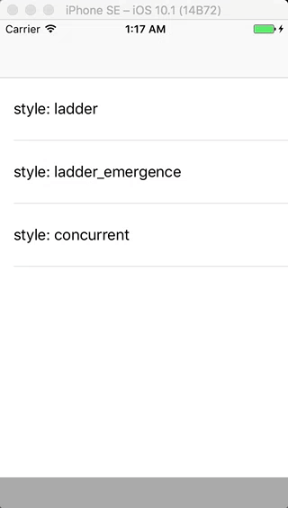

# ActionCell

[](https://travis-ci.org/wonderbear/ActionCell) [](http://cocoapods.org/pods/ActionCell) [](http://cocoapods.org/pods/ActionCell)
[](https://developer.apple.com/swift/) [](https://github.com/Carthage/Carthage) [](http://cocoapods.org/pods/ActionCell)

ActionCell, wraps UITableViewCell with actions elegantly, no need to inherit UITableViewCell, use swiping to trigger actions (known from the Mailbox App). I love it.



## Contents

- [Features](#Features)
- [Requirements](#Requirements)
- [Attention](#Attention)
- [Example](#Example)
- [Installation](#Installation)
- [Protocols](#Protocols)
- [Usage](#Usage)
- [Properties & Methods](#Properties & Methods)
- [Author](#Author)
- [License](#License)

## Features

- [x] Flexible, No need to inherit UITableViewCell
- [x] Easy to use
- [x] Customizable action control
- [x] Support default action

## Requirements

- iOS 8.0+ / Mac OS X 10.11+ / tvOS 9.0+
- Xcode 8.0+
- Swift 3.0+

## Attention

From version 2.0, the ActionCell framework is redesigned, so API is different from version 2.* to 1.*, if you used old version before, you must do some change, but not much.

## Installation

### CocoaPods

[CocoaPods](http://cocoapods.org) is a dependency manager for Cocoa projects. You can install it with the following command:

```bash
$ gem install cocoapods
```

To integrate ActionCell into your Xcode project using CocoaPods, specify it in your `Podfile`:

```ruby
source 'https://github.com/CocoaPods/Specs.git'
platform :ios, '8.0'
use_frameworks!

target '<Your Target Name>' do
    pod 'ActionCell', '~> 2.0.0'
end
```

Then, run the following command:

```bash
$ pod install
```

### Carthage

[Carthage](https://github.com/Carthage/Carthage) is a decentralized dependency manager that builds your dependencies and provides you with binary frameworks.

You can install Carthage with [Homebrew](http://brew.sh/) using the following command:

```bash
$ brew update
$ brew install carthage
```

To integrate ActionCell into your Xcode project using Carthage, specify it in your `Cartfile`:

```ogdl
github "xiongxiong/ActionCell" ~> 2.0.0
```

Run `carthage update` to build the framework and drag the built `ActionCell.framework` into your Xcode project.

### Manually

If you prefer not to use either of the aforementioned dependency managers, you can integrate ActionCell into your project manually.

## Example

Open the example project, build and run.

## Protocols

### ActionCellDelegate

```swift
public protocol ActionCellDelegate: NSObjectProtocol {

    var tableView: UITableView! { get }
    /// Do something when action is triggered
    func didActionTriggered(cell: UITableViewCell, action: String)
}
```

```swift
public protocol ActionControlDelegate: NSObjectProtocol {
    func didActionTriggered(action: String)
}
```

```swift
public protocol ActionSheetDelegate: NSObjectProtocol {
    /// Setup action sheet
    func setupActionsheet(side: ActionSide, actions: [ActionControl])
    /// Open action sheet
    func openActionsheet(side: ActionSide, completionHandler: (() -> ())?)
    /// Close action sheet
    func closeActionsheet(_ completionHandler: (() -> ())?)
}
```

## Usage

1. Implement ActionCellDelegate

```swift
extension ViewController: ActionCellDelegate {

    public func didActionTriggered(cell: UITableViewCell, action: String) {
        ...
    }
}
```

2. Wrap your UITableViewCell with ActionCell

```swift
func tableView(_ tableView: UITableView, cellForRowAt indexPath: IndexPath) -> UITableViewCell {
  let cell = tableView.dequeueReusableCell(withIdentifier: "reuseId")!
              ... (cell customization)
              // create wrapper
              let wrapper = ActionCell()
              // set delegate
              wrapper.delegate = self
              // set animationStyle
              wrapper.animationStyle = .ladder
              // wrap cell with actions
              wrapper.wrap(cell: cell,
                           actionsLeft: [
                              {
                                  let action = IconTextAction(action: "cell 0 -- left 0")
                                  action.icon.image = #imageLiteral(resourceName: "image_5").withRenderingMode(.alwaysTemplate)
                                  action.icon.tintColor = UIColor.white
                                  action.label.text = "Hello"
                                  action.label.font = UIFont.systemFont(ofSize: 12)
                                  action.label.textColor = UIColor.white
                                  action.backgroundColor = UIColor(red:0.14, green:0.69, blue:0.67, alpha:1.00)
                                  return action
                              }(),
                              {
                                  let action = TextAction(action: "cell 0 -- left 1")
                                  action.label.text = "Long Sentence"
                                  action.label.font = UIFont.systemFont(ofSize: 12)
                                  action.label.textColor = UIColor.white
                                  action.backgroundColor = UIColor(red:1.00, green:0.78, blue:0.80, alpha:1.00)
                                  return action
                              }(),
                              {
                                  let action = IconAction(action: "cell 0 -- left 2")
                                  action.icon.image = #imageLiteral(resourceName: "image_0").withRenderingMode(.alwaysTemplate)
                                  action.icon.tintColor = UIColor.white
                                  action.backgroundColor = UIColor(red:0.51, green:0.83, blue:0.73, alpha:1.00)
                                  return action
                              }(),
                              ],
                           actionsRight: [
                              {
                                  let action = IconTextAction(action: "cell 0 -- right 0")
                                  action.icon.image = #imageLiteral(resourceName: "image_1").withRenderingMode(.alwaysTemplate)
                                  action.icon.tintColor = UIColor.white
                                  action.label.text = "Hello"
                                  action.label.font = UIFont.systemFont(ofSize: 12)
                                  action.label.textColor = UIColor.white
                                  action.backgroundColor = UIColor(red:0.14, green:0.69, blue:0.67, alpha:1.00)
                                  return action
                              }(),
                              {
                                  let action = TextAction(action: "cell 0 -- right 1")
                                  action.label.text = "Long Sentence"
                                  action.label.font = UIFont.systemFont(ofSize: 12)
                                  action.label.textColor = UIColor.white
                                  action.backgroundColor = UIColor(red:0.51, green:0.83, blue:0.73, alpha:1.00)
                                  return action
                              }(),
                              {
                                  let action = IconAction(action: "cell 0 -- right 2")
                                  action.icon.image = #imageLiteral(resourceName: "image_2").withRenderingMode(.alwaysTemplate)
                                  action.icon.tintColor = UIColor.white
                                  action.backgroundColor = UIColor(red:1.00, green:0.78, blue:0.80, alpha:1.00)
                                  return action
                              }(),
                              ])
              return cell
}
```

### Inherit ActionControl [Optional]
IconAction, TextAction & IconTextAction are already implemented, you can use it straightforwardly, or you can choose to implement ActionControlDelegate to create your own ActionControl.

## Properties & Methods

* ActionCell
wrap(cell target: UITableViewCell, actionsLeft: [ActionControl] = [], actionsRight: [ActionControl] = [])
* IconAction
init(action: String, width: CGFloat = 80, iconSize: CGSize = CGSize(width: 20, height: 20))
* TextAction
init(action: String, width: CGFloat = 80)
* IconTextAction
init(action: String, width: CGFloat = 80, iconSize: CGSize = CGSize(width: 20, height: 20), space: CGFloat = 5, offset: CGFloat = -3)
* UITableViewCell
var isActionSheetOpened: Bool
setupActionsheet(side: ActionSide, actions: [ActionControl] = []) // Change actionsheet's actions
openActionsheet(side: ActionSide, completionHandler: (() -> ())? = nil)
closeActionsheet(_ completionHandler: (() -> ())? = nil)

### Style
- animationStyle: AnimationStyle = ladder | ladder_emergence | concurrent // Action animation style
- enableDefaultAction: Bool // Enable default action to be triggered when the content is panned to far enough
- defaultActionTriggerPropotion: CGFloat // The propotion of (state public to state trigger-prepare / state public to state trigger), about where the default action is triggered
- defaultActionIconColor: UIColor? // Default action's icon color
- defaultActionBackImage: UIImage? // Default action's back image
- defaultActionBackColor: UIColor? // Default action's back color

### Behavior

- enableDefaultAction: Bool // Enable default action to be triggered when the content is panned to far enough
- defaultActionIndexLeft: Int // Index of default action - Left
- defaultActionIndexRight: Int // Index of default action - Right

### Animation

- animationDuration: NSTimeInterval // Spring animation - duration of the animation
- animationDelay: TimeInterval // Spring animation - delay of the animation
- springDamping: CGFloat // Spring animation - spring damping of the animation
- initialSpringVelocity: CGFloat // Spring animation - initial spring velocity of the animation
- animationOptions: UIViewAnimationOptions // Spring animation - options of the animation

## Author

xiongxiong, ximengwuheng@163.com

## License

ActionCell is available under the MIT license. See the LICENSE file for more info.
